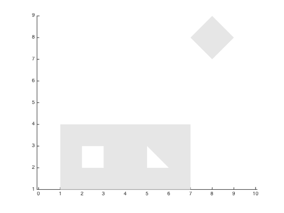
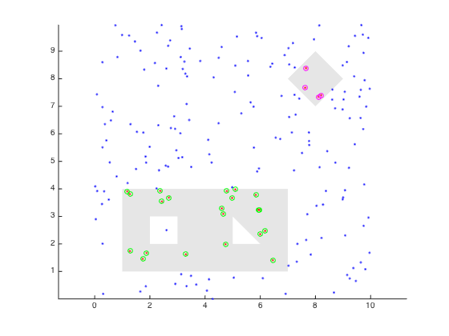

## inpolygons.m Documentation

This function checks whether a point or points is inside one or more polygons.
The polygons can have holes in them.  When dealing with a large number of points and/or polygons, this can be faster that inpolygon.m.

### Syntax

```
in = inpolygons(x,y,xv,yv)
[in, index] = inpolygons(x,y,xv,yv)
```
See function help for description of input and output variables.

### Example

We'll start with two polygons: a rectangle with square- and triangle-shaped holes, and a solid diamond:

```matlab
xv = [1 1 7 7 1 NaN 2 3 3 2 2 NaN 5 6 5 5 NaN 7 8 9 8 7];
yv = [1 4 4 1 1 NaN 2 2 3 3 2 NaN 2 2 3 2 NaN 8 9 8 7 8];

[f, v] = poly2fv(xv, yv);

patch('Faces', f, 'Vertices', v, ...
      'FaceColor', [.9 .9 .9], ...
      'EdgeColor', 'none');
```



Now, we scatter a couple hundred random points, and test which polygons they fall into.




